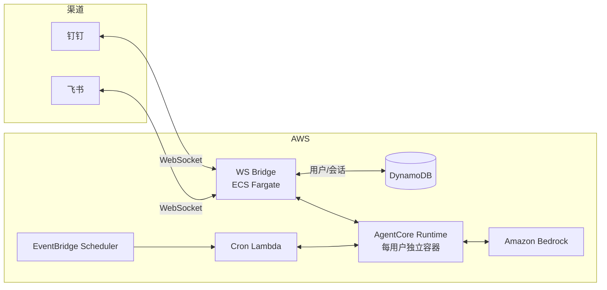

# OpenClaw on AWS Bedrock AgentCore

[](LICENSE)
[]()
[]()

> **实验性项目** — 仅供学习和实验使用，**不适用于生产环境**。架构和配置可能随时变更。

在 AWS Bedrock AgentCore Runtime 上部署多渠道 AI 聊天机器人（钉钉、飞书），使用 CDK 管理基础设施。通过 WebSocket 多机器人桥接服务接入钉钉和飞书，每个用户拥有独立的 AgentCore 容器。

---

## 架构概览



**工作原理**：钉钉和飞书通过 WebSocket 连接到 WS Bridge（ECS Fargate），Bridge 解析用户身份后路由到每用户独立的 AgentCore 容器。每个用户拥有隔离的计算环境、持久化工作空间和大模型访问权限。

### 核心特性

- **每用户 microVM 隔离** — AgentCore Runtime 为每个用户创建独立的 Firecracker 容器
- **多机器人支持** — 单个 ECS 服务同时运行多个钉钉和飞书机器人实例
- **多模态** — 支持文本 + 图片消息（JPEG、PNG、GIF、WebP，最大 3.75 MB）
- **跨渠道账号绑定** — 不同渠道/机器人的账号可链接到同一用户身份和会话
- **即时反馈** — 收到消息后立即显示表情反应（钉钉🤔思考中 / 飞书 OnIt），处理完成后自动移除
- **持久化工作空间** — `.openclaw/` 目录自动同步到 S3，会话重启后恢复
- **定时任务** — EventBridge Scheduler 支持自然语言创建 cron 任务
- **文件管理** — S3 用户文件隔离存储，支持原生文件发送到聊天
- **API 密钥管理** — 双模式存储（本地文件 / AWS Secrets Manager）
- **STS 会话凭证** — 每用户 S3 命名空间隔离，防止跨用户数据访问
- **社区技能** — 5 个预装 ClawHub 技能（jina-reader、deep-research-pro 等）

---

## 前置条件

| 工具 | 版本要求 | 说明 |
|------|---------|------|
| AWS CLI | v2 | `aws sts get-caller-identity` 能成功 |
| AWS CDK | v2 | `npm install -g aws-cdk` |
| Python | 3.11+ | CDK 应用运行环境 |
| Node.js | 18+ | CDK CLI 运行环境 |
| AgentCore CLI | 最新 | `pip install bedrock-agentcore-toolkit` |

> Docker 仅在本地构建模式下需要。默认使用 CodeBuild 云端构建，无需本地 Docker。

---

## 快速开始

### 1. 克隆并配置

```bash
git clone https://github.com/aws-samples/sample-host-openclaw-on-amazon-bedrock-agentcore.git
cd sample-host-openclaw-on-amazon-bedrock-agentcore

export CDK_DEFAULT_ACCOUNT=$(aws sts get-caller-identity --query Account --output text)
export CDK_DEFAULT_REGION=us-west-2
```

### 2. 安装依赖

```bash
python3 -m venv .venv
source .venv/bin/activate
pip install -r requirements.txt
pip install bedrock-agentcore-toolkit
```

### 3. 配置 cdk.json

确保以下关键参数已设置：

```json
{
  "context": {
    "region": "us-west-2",
    "default_model_id": "global.anthropic.claude-opus-4-6-v1",
    "ws_bridge_enabled": true,
    "registration_open": false
  }
}
```

### 4. CDK Bootstrap（首次）

```bash
cdk bootstrap aws://$CDK_DEFAULT_ACCOUNT/$CDK_DEFAULT_REGION
```

### 5. 部署

```bash
cdk synth          # 验证 + cdk-nag 安全检查
./scripts/deploy.sh
```

部署分三个阶段自动执行：

| 阶段 | 内容 | 耗时 |
|------|------|------|
| Phase 1 | CDK 基础设施（VPC、安全、AgentCore、监控） | ~5 分钟 |
| Phase 2 | Starter Toolkit（Runtime、ECR、Docker 镜像） | ~10 分钟 |
| Phase 3 | CDK 依赖栈（Cron、**WS Bridge**、Token 监控） | ~5 分钟 |

#### 构建模式

| 模式 | 命令 | 需要 Docker | 说明 |
|------|------|------------|------|
| **CodeBuild**（默认） | `./scripts/deploy.sh` | 否 | 在 AWS CodeBuild 中构建 ARM64 镜像 |
| **本地构建** | `BUILD_MODE=local ./scripts/deploy.sh` | 是 | 本地 Docker 构建 |

#### 单独运行某阶段

```bash
./scripts/deploy.sh --phase1         # 仅基础设施
./scripts/deploy.sh --runtime-only   # 仅 Runtime（Phase 2）
./scripts/deploy.sh --phase3         # 仅依赖栈
./scripts/deploy.sh --cdk-only       # 跳过 Starter Toolkit
```

### 6. 配置钉钉/飞书机器人

```bash
./scripts/setup-multi-bot.sh
```

交互式脚本，支持：
- 添加/删除/列出钉钉和飞书机器人
- 自动存储凭证到 Secrets Manager
- 自动添加用户白名单
- 强制 ECS 重新部署

详细配置步骤（钉钉开放平台、飞书开发者控制台设置等）参见 [部署手册](docs/部署手册.md)。

### 7. 验证

向钉钉或飞书机器人发送消息。首次消息触发冷启动（约 1-2 分钟），期间会立即显示表情反应（钉钉🤔思考中 / 飞书 OnIt）作为视觉反馈。OpenClaw 就绪后即可使用全部功能。后续消息响应很快。

---

## 工作原理

### 消息流程

1. 用户在钉钉/飞书发送消息
2. WS Bridge 通过 WebSocket 接收消息，立即显示表情反应
3. 解析用户身份（DynamoDB），下载并上传图片到 S3（如有）
4. 调用 `InvokeAgentRuntime`，路由到用户的 AgentCore 容器
5. 容器内 OpenClaw 通过 WebSocket bridge 处理消息，Proxy 转换为 Bedrock ConverseStream API
6. 响应返回 → 递归解包内容块 → 移除表情反应 → 原生文件/图片发送 → 文本回复

### 容器启动流程

1. **entrypoint.sh** — 配置 IPv4 DNS，启动 contract server
2. **contract server**（8080 端口） — 立即响应 `/ping` 健康检查
3. **首次 `/invocations`** — 并行初始化：
   - 获取 Secrets Manager 密钥
   - 创建 STS 范围凭证（限制 S3 访问到用户命名空间）
   - 启动 Bedrock Proxy（18790 端口）
   - 启动 OpenClaw Gateway（18789 端口）
   - 从 S3 恢复 `.openclaw/` 工作空间
4. **冷启动等待**（约 1-2 分钟） — 消息阻塞直到 OpenClaw 就绪，渠道侧的表情反应提供即时视觉反馈
5. **就绪** — OpenClaw 通过 WebSocket bridge 处理所有消息
6. **SIGTERM** — 保存 `.openclaw/` 到 S3，关闭子进程

### 每用户会话

每个用户拥有独立的 AgentCore microVM：
- **隔离计算** — Firecracker 容器级隔离
- **隔离存储** — STS 范围凭证限制 S3 访问到 `{namespace}/` 前缀
- **持久工作空间** — `.openclaw/` 定时同步到 S3（默认 5 分钟）
- **空闲回收** — 默认 30 分钟无消息后终止容器，下次消息自动重建

### 跨渠道账号绑定

1. 在第一个渠道/机器人发送 `link` → 获取 8 位绑定码
2. 在第二个渠道/机器人发送 `link A1B2C3D4` → 账号绑定成功
3. 绑定后共享同一用户身份、会话和对话历史

> 飞书 `open_id` 是应用级别的 — 同一用户在不同飞书机器人中有不同 ID，需要分别添加白名单。

### 定时任务

用自然语言创建定时任务：

| 用户消息 | 机器人操作 |
|---------|-----------|
| "每天早上 9 点提醒我查看邮件" | 创建每日 9:00 定时任务 |
| "每个工作日下午 5 点提醒我打卡" | 创建周一至周五 17:00 任务 |
| "我有哪些定时任务？" | 列出所有活跃任务 |
| "删除我的早间提醒" | 删除指定任务 |

底层使用 EventBridge Scheduler + Cron Lambda 实现，会话不活跃时也能触发。响应自动发送到用户最后使用的机器人。

### 多机器人架构

WS Bridge 采用混合线程模型：
- **钉钉** — 每个机器人一个独立线程（SDK 管理自己的事件循环）
- **飞书** — 所有飞书机器人共享一个线程（`lark-oapi` SDK 的模块级事件循环限制）

每个机器人可独立配置受限白名单（`BOT_ALLOW#` / `BOT_META#`），实现机器人级别的访问控制。

---

## 配置参数

所有参数在 `cdk.json` 的 `context` 中配置：

| 参数 | 默认值 | 说明 |
|------|--------|------|
| `region` | `us-west-2` | AWS 部署区域 |
| `default_model_id` | `global.anthropic.claude-opus-4-6-v1` | Bedrock 模型 ID |
| `subagent_model_id` | （空） | 子代理模型 ID，空 = 使用主模型 |
| `ws_bridge_enabled` | `true` | 启用多机器人 WebSocket 桥接 |
| `ws_bridge_cpu` | `256` | WS Bridge ECS 任务 CPU（256 = 0.25 vCPU） |
| `ws_bridge_memory_mb` | `512` | WS Bridge ECS 任务内存（MB） |
| `session_idle_timeout` | `1800` | 会话空闲超时（秒） |
| `session_max_lifetime` | `28800` | 会话最大生命周期（秒） |
| `registration_open` | `false` | 是否开放注册（false = 仅白名单用户） |
| `enable_browser` | `false` | 启用无头浏览器 |
| `enable_guardrails` | `true` | 启用 Bedrock Guardrails 内容过滤 |
| `enable_cloudtrail` | `false` | 启用专用 CloudTrail |
| `daily_cost_budget_usd` | `5` | 每日成本预算告警阈值（美元） |
| `cron_lead_time_minutes` | `5` | 定时任务提前预热时间（分钟） |

---

## CDK 栈

| 栈 | 资源 | 依赖 |
|---|---|---|
| **OpenClawVpc** | VPC、子网、NAT、7 个 VPC 端点 | 无 |
| **OpenClawSecurity** | KMS CMK、Secrets Manager、Cognito | 无 |
| **OpenClawAgentCore** | Runtime、ECR、S3、IAM | Vpc, Security |
| **OpenClawWsBridge** | ECS Fargate、ECR、CloudWatch（钉钉/飞书多机器人） | Vpc, Security, AgentCore |
| **OpenClawCron** | EventBridge Scheduler、Cron Lambda | AgentCore, Security |
| **OpenClawObservability** | CloudWatch 仪表盘、告警、Bedrock 日志 | 无 |
| **OpenClawTokenMonitoring** | DynamoDB、Lambda、分析仪表盘 | Observability |

---

## 工具和技能

### 内置工具

OpenClaw 使用 `full` 工具配置，包括 web、文件系统、运行时、会话、自动化等内置工具组。

### 自定义技能

| 技能 | 用途 |
|------|------|
| `s3-user-files` | 每用户 S3 文件存储（读/写/列/删） |
| `eventbridge-cron` | EventBridge 定时任务管理 |
| `clawhub-manage` | ClawHub 社区技能安装/卸载 |
| `api-keys` | API 密钥管理（本地文件 + Secrets Manager） |
| `agentcore-browser` | 无头浏览器（可选） |

### 预装 ClawHub 技能

| 技能 | 用途 |
|------|------|
| `jina-reader` | 网页内容提取为 Markdown |
| `deep-research-pro` | 深度多步骤研究（使用子代理） |
| `telegram-compose` | 富文本格式化 |
| `transcript` | YouTube 视频字幕提取 |
| `task-decomposer` | 复杂任务分解（使用子代理） |

---

## 运维操作

### 检查运行状态

```bash
agentcore status --agent openclaw_agent --verbose
```

### 更新容器镜像

```bash
./scripts/deploy.sh --runtime-only   # 重新构建并部署容器
```

### 停止用户会话

部署新镜像后需停止旧会话，下次消息自动使用新容器：

```bash
# 查找会话 ID
aws dynamodb scan --table-name openclaw-identity --region $CDK_DEFAULT_REGION \
  --filter-expression "SK = :sk" \
  --expression-attribute-values '{":sk":{"S":"SESSION"}}' \
  --query 'Items[*].{PK:PK.S,sessionId:sessionId.S}' --output table

# 停止指定会话
aws bedrock-agentcore stop-runtime-session \
  --agent-runtime-arn "arn:aws:bedrock-agentcore:$CDK_DEFAULT_REGION:$CDK_DEFAULT_ACCOUNT:runtime/<RUNTIME_ID>" \
  --runtime-session-id "<SESSION_ID>" \
  --region $CDK_DEFAULT_REGION
```

### 管理白名单

```bash
./scripts/manage-allowlist.sh add dingtalk:STAFF_ID      # 添加钉钉用户
./scripts/manage-allowlist.sh add feishu:ou_OPEN_ID      # 添加飞书用户
./scripts/manage-allowlist.sh remove dingtalk:STAFF_ID   # 移除用户
./scripts/manage-allowlist.sh list                        # 列出所有用户
```

### 管理机器人

```bash
./scripts/setup-multi-bot.sh add       # 添加机器人
./scripts/setup-multi-bot.sh list      # 列出已配置的机器人
./scripts/setup-multi-bot.sh remove    # 删除机器人
./scripts/setup-multi-bot.sh restart   # 强制 ECS 重新部署
```

### 运行测试

```bash
# Bridge 单元测试
cd bridge && node --test image-support.test.js
cd bridge && node --test content-extraction.test.js
cd bridge && node --test scoped-credentials.test.js
cd bridge && node --test workspace-sync.test.js

# E2E 测试（需要已部署的栈）
pytest tests/e2e/bot_test.py -v
```

---

## 常见问题

### 首条消息响应慢（1-2 分钟）

正常现象。首次消息触发 AgentCore 容器冷启动（microVM 创建 + OpenClaw 初始化）。渠道侧会立即显示表情反应作为视觉反馈。后续消息在同一会话内响应很快。

### 飞书表情反应不显示

需要在飞书开发者控制台添加 `im:message:reaction` 权限并重新发布应用。

### 飞书文件发送失败

需要在飞书开发者控制台添加 `im:resource` 权限。文件类型映射：audio → opus/ogg，media → mp4/mov，file → 其他。

### VPC 中 Node.js 连接超时

Node.js 22 的 Happy Eyeballs 在没有 IPv6 的 VPC 中会失败。`force-ipv4.js` 通过 `NODE_OPTIONS` 强制 IPv4 解析。

### `update-agent-runtime` 后环境变量丢失

这是全量替换 API — 省略 `--environment-variables` 会清除所有环境变量。每次更新必须包含完整的环境变量 JSON。推荐使用 `./scripts/deploy.sh` 自动处理。

---

## 安全

- **网络隔离** — 私有 VPC 子网 + VPC 端点，容器不直接暴露到公网
- **每用户隔离** — 独立 microVM + STS 范围凭证限制 S3 命名空间
- **加密** — KMS CMK 加密所有静态数据，TLS 加密传输数据
- **最小权限 IAM** — 每个组件精细的权限策略
- **Bedrock Guardrails** — 内容过滤、PII 脱敏、主题拒绝（可选）
- **cdk-nag** — 每次 `cdk synth` 自动运行安全检查

详见 [docs/security.md](docs/security.md)。

---

## 清理

```bash
cdk destroy --all                            # 销毁 CDK 栈
agentcore destroy --agent openclaw_agent     # 销毁 Starter Toolkit 资源
```

> KMS 密钥和 Cognito User Pool 设置了 `RETAIN` 策略，不会自动删除。

---

## 许可证

MIT-0 License. 详见 [LICENSE](LICENSE)。
