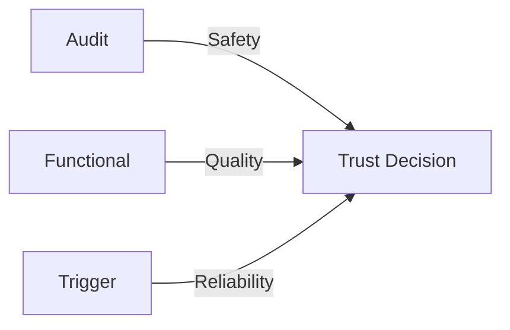
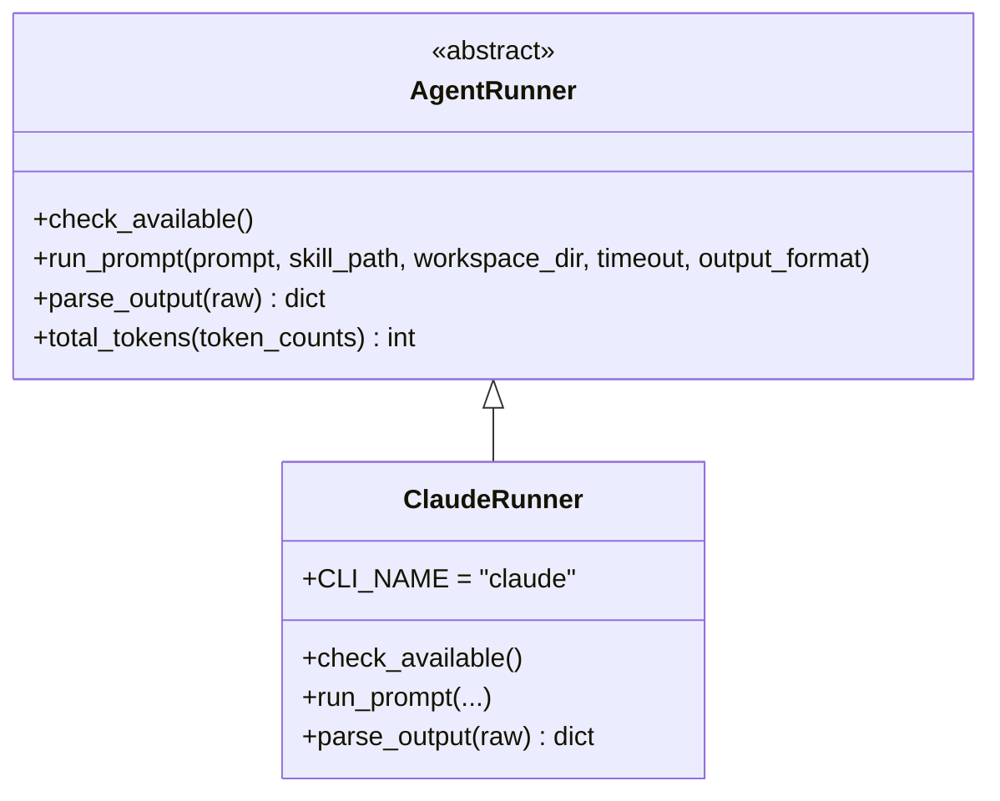

# Core Concepts

## What is an Agent Skill?

An Agent Skill is a directory containing a `SKILL.md` file that gives an AI agent specialized capabilities. The `SKILL.md` follows the [agentskills.io specification](https://agentskills.io/specification) and includes:

- **YAML frontmatter** — metadata: `name`, `description`, `license`, `allowed-tools`, `metadata` (author, version)
- **Markdown body** — instructions the agent reads to learn the skill's behavior
- **Supporting files** — scripts, templates, reference data the skill needs
- **Eval files** (optional) — `evals/evals.json` and `evals/eval_queries.json` for quality testing

```
my-skill/
├── SKILL.md              # Required: frontmatter + instructions
├── evals/
│   ├── evals.json        # Functional eval cases
│   ├── eval_queries.json # Trigger queries
│   └── files/            # Test input files
└── scripts/              # Optional supporting code
```

## The Security Problem

Installing a skill means injecting a stranger's instructions into your agent's context. That stranger's code gets access to whatever tools your agent has — file system, shell, network. A malicious or careless skill can:

- **Exfiltrate data** — send your files to an external server via URLs in the instructions
- **Escalate privileges** — request `Bash(*)` to run arbitrary commands
- **Inject prompts** — instruct the agent to ignore user intent
- **Install malware** — use `curl | bash` or `npx -y` to pull and execute remote code
- **Deserialize payloads** — use `pickle.load` or `yaml.load` to execute arbitrary code
- **Connect to external servers** — configure MCP server connections to untrusted endpoints

skill-eval exists to surface these risks before you install.

## Three Pillars of Evaluation

skill-eval evaluates skills across three complementary dimensions:



### Pillar 1: Audit (Safety)

Static analysis of the skill directory. No agent CLI needed. Checks:

| Category | Codes | What it finds |
|----------|-------|---------------|
| Structure | STR-xxx | Missing SKILL.md, invalid frontmatter, naming issues |
| Security | SEC-001 | Hardcoded secrets (API keys, tokens, passwords) |
| Security | SEC-002 | External URLs (data exfiltration surface) |
| Security | SEC-003 | Subprocess/shell execution patterns |
| Security | SEC-004 | Unsafe dependency installation (curl\|bash, unpinned pip) |
| Security | SEC-005 | Prompt injection surface in instructions |
| Security | SEC-006 | Unsafe deserialization (pickle, yaml.load, marshal, shelve) |
| Security | SEC-007 | Dynamic import/code generation (importlib, \_\_import\_\_, compile) |
| Security | SEC-008 | Base64 encoded payloads (b64decode near eval/exec) |
| Security | SEC-009 | MCP server references (mcpServers config, npx -y, MCP/SSE endpoints) |
| Permissions | PERM-xxx | Over-privileged tool declarations, sensitive paths |

### Pillar 2: Functional (Quality)

Live evaluation using an agent CLI. Runs each eval case **with** and **without** the skill installed, then grades the output against assertions. This measures whether the skill actually improves the agent's output.

Grading uses two methods:
- **Deterministic** — pattern matching: `contains`, `does not contain`, `matches regex`, `is valid JSON`, `starts with`, `ends with`, `has at least N lines`
- **LLM fallback** — for semantic assertions that can't be matched deterministically

### Pillar 3: Trigger (Reliability)

Live evaluation that tests activation precision. Sends queries labeled `should_trigger: true` or `should_trigger: false` to the agent and measures whether the skill correctly activates or stays silent. Each query is run multiple times to compute a trigger rate.

## Scoring System

### Audit Scoring

Starts at 100, deducts per finding:

| Severity | Deduction | Meaning |
|----------|-----------|---------|
| CRITICAL | -25 | Must fix. Blocks CI. |
| WARNING | -10 | Should fix. |
| INFO | -2 | Nice to fix. |

Score is floored at 0. Letter grades:

| Grade | Score Range |
|-------|-------------|
| A | 90 - 100 |
| B | 80 - 89 |
| C | 70 - 79 |
| D | 60 - 69 |
| F | 0 - 59 |

A skill with **any CRITICAL findings** fails the audit regardless of score.

### Unified Report Scoring

The `report` command combines all three pillars into a single 0-1 score:

```
overall = audit_normalized × 0.4 + functional_score × 0.4 + trigger_pass_rate × 0.2
```

- `audit_normalized` = audit score / 100
- `functional_score` = overall assertion pass rate (0-1)
- `trigger_pass_rate` = fraction of trigger queries that passed (0-1)

If a phase is skipped or its eval files don't exist, its weight is redistributed proportionally to the remaining phases.

The same A-F letter grade scale applies to the 0-1 overall score (e.g., 0.9+ = A).

### Functional 4-Dimension Scoring

Functional evaluation produces four dimension scores:

- **Outcome** — assertion pass rate across all eval cases
- **Process** — tool usage appropriateness (did the agent use the right tools?)
- **Style** — output formatting quality
- **Efficiency** — tokens consumed per passing assertion (lower is better)

## The AgentRunner Abstraction

skill-eval is designed to be agent-agnostic. The `AgentRunner` abstract class (`skill_eval/agent_runner.py`) defines the interface any agent CLI must implement:



**Key methods:**

| Method | Purpose |
|--------|---------|
| `check_available()` | Verify the CLI is on PATH |
| `run_prompt()` | Execute a prompt, optionally with skill injection |
| `parse_output()` | Parse CLI output into structured data (events, tool calls, text, token counts) |
| `total_tokens()` | Sum token consumption from parsed output |

The built-in `ClaudeRunner` is registered as `"claude"` and used by default. To support a different agent:

1. Subclass `AgentRunner`
2. Implement the four abstract methods
3. Call `register_runner("my-agent", MyRunner)`
4. Use `--agent my-agent` on the command line

## Eval File Formats

### `evals/evals.json` — Functional Eval Cases

A JSON array of eval case objects:

```json
[
  {
    "id": "csv-summary",
    "prompt": "Read the file sample.csv and output a summary with the number of rows and the column names.",
    "expected_output": "The CSV has 3 rows and columns: name, age, city",
    "files": ["files/sample.csv"],
    "assertions": [
      "contains 'name'",
      "contains 'age'",
      "contains 'city'",
      "has at least 1 lines"
    ]
  }
]
```

| Field | Type | Required | Description |
|-------|------|----------|-------------|
| `id` | string | yes | Unique identifier for the eval case |
| `prompt` | string | yes | The task to send to the agent |
| `expected_output` | string | no | Reference answer (used for LLM grading) |
| `files` | string[] | no | Paths to files copied into the workspace (relative to `evals/`) |
| `assertions` | string[] | yes | Grading rules applied to the agent's output |

**Assertion types:**

| Assertion | Example | Method |
|-----------|---------|--------|
| `contains 'text'` | `contains 'name'` | Deterministic |
| `does not contain 'text'` | `does not contain 'error'` | Deterministic |
| `matches regex /pattern/` | `matches regex /\d+ rows/` | Deterministic |
| `is valid JSON` | `is valid JSON` | Deterministic |
| `starts with 'text'` | `starts with '{'` | Deterministic |
| `ends with 'text'` | `ends with '}'` | Deterministic |
| `has at least N lines` | `has at least 3 lines` | Deterministic |
| _(anything else)_ | `output is relevant to: data analysis` | LLM fallback |

### `evals/eval_queries.json` — Trigger Queries

A JSON array of trigger query objects:

```json
[
  {"query": "Analyze the CSV file and give me summary statistics", "should_trigger": true},
  {"query": "Write me a haiku about the ocean", "should_trigger": false}
]
```

| Field | Type | Required | Description |
|-------|------|----------|-------------|
| `query` | string | yes | The query to send to the agent |
| `should_trigger` | boolean | yes | Whether the skill should activate for this query |

A `should_trigger: true` query passes if the skill activates on a majority of runs. A `should_trigger: false` query passes if the skill stays silent on all runs.

## CI Exit Codes

All commands use consistent exit codes for CI integration:

| Command | Exit 0 | Exit 1 | Exit 2 |
|---------|--------|--------|--------|
| `audit` | No critical findings | Warnings (with `--fail-on-warning`) | Critical findings |
| `init` | Success | Error (SKILL.md not found) | — |
| `snapshot` | Success | Error | — |
| `regression` | No regressions | Regression detected | Baseline not found |
| `functional` | Skill meets quality bar | Skill underperforms | Error (file/JSON) |
| `trigger` | All queries passed | One or more failed | Error (file/JSON) |
| `compare` | Success | — | Error (file/JSON) |
| `report` | All phases passed | One or more phases failed | — |
